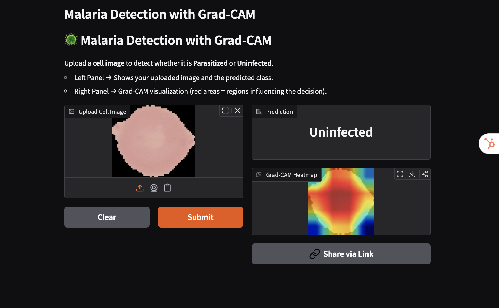

# 🖼️ Computer Vision Portfolio

This repo contains my Computer Vision learning journey using **Colab + PyTorch** 🚀

## 📂 Projects

### Cats🐱 vs Dogs🐶 Classification
- [Link to Notebook](notebooks/Transfer_Learning_VGG_16.ipynb)  

### Facial Keypoints Detection
- [Link to Notebook](notebooks/Facial%20Keypoints%20Detection.ipynb)

- Live demo: [Hugging Face Space](https://huggingface.co/spaces/faranbutt789/Facial_Keypoint_Detection)

### 🧠 FairFace Multi-task Age & Gender Predictor
- [Link to Notebook](notebooks/Mutitask%20Gender%20and%20Age%20Prediction.ipynb)

- Live demo: [Hugging Face Space](https://huggingface.co/spaces/faranbutt789/Multitask_Gender_and_Age_Classifier)

### 🦠 Malaria Detection with Grad-CAM

- [Link to Notebook](notebooks/malaria-detection-grad-cam.ipynb)

- Live demo: [Hugging Face Space](https://huggingface.co/spaces/faranbutt789/Malaria-CAM)

### 🚦 Traffic Sign Classifier

- [Link to Notebook](notebooks/TrafficSignNet.ipynb)

- Live demo: [Hugging Face Space](https://huggingface.co/spaces/faranbutt789/TrafficSignNet)

